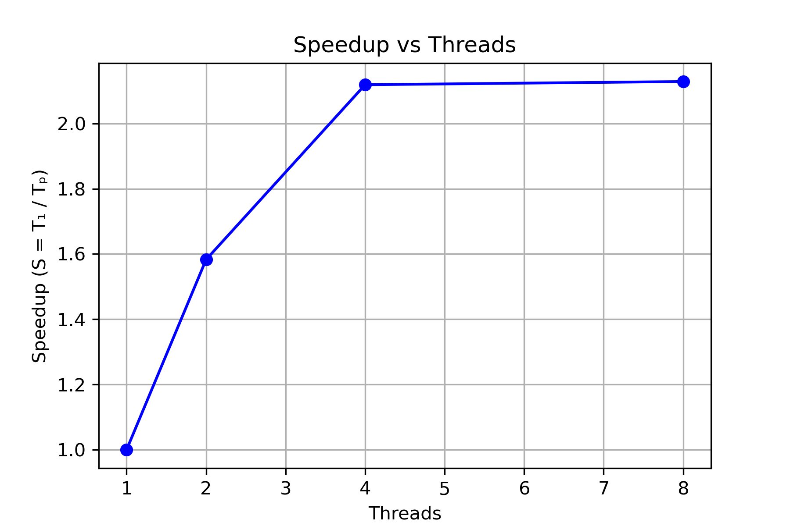
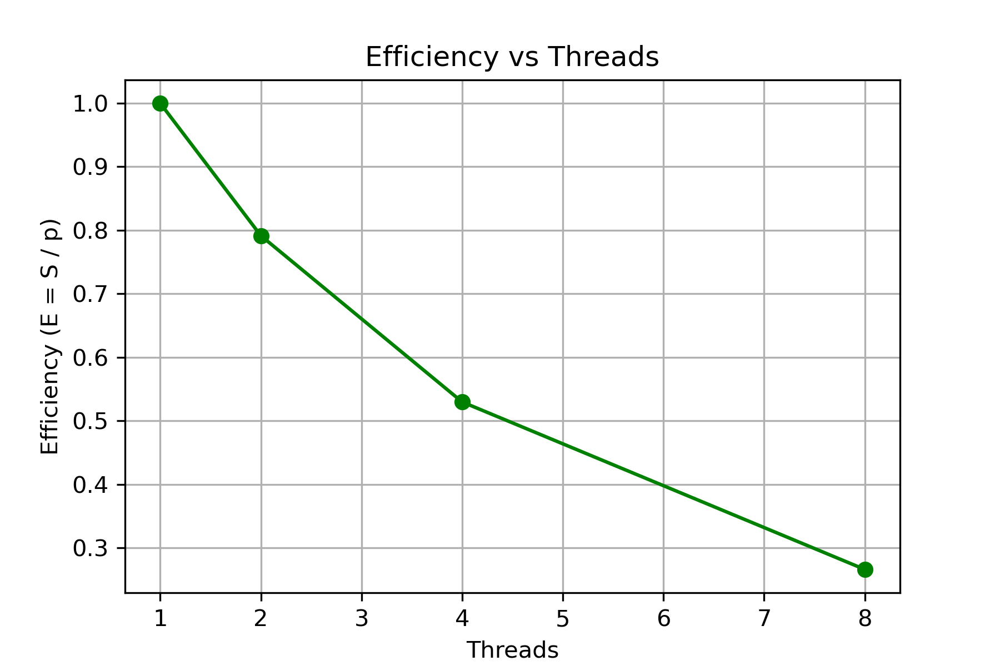

# SW401 Phase 1 Project

## Project: Word Count (Phase 1)

### Description
This project implements a sequential and a shared-memory parallel version (OpenMP) of a word count program.

### Features

Sequential implementation: src/wc_seq.cpp
Parallel implementation (OpenMP): src/wc_parallel.cpp
Performance comparison: sequential vs. parallel (1, 2, 4, 8 threads)
Input files: Provided in /data/ directory

### Folder Structure
- `src/` : C++ source code
- `data/` : Sample input files
- `plots/` : Performance plots
- `report.pdf` : Project report
### How to Calculate S and E
Speedup (S) = Sequential Time / Parallel Time
Efficiency (E) = S /p

 
 ##  Performance Evaluation

**Input:** very_huge_input.txt (10 million lines)

| Threads | Runtime (s) | Speedup | Efficiency |
|----------|------------|---------|------------|
| 1        | 0.629682   | 1.00    | 1.00       |
| 2        | 0.397797   | 1.58    | 0.79       |
| 4        | 0.297168   | 2.12    | 0.53       |
| 8        | 0.295796   | 2.13    | 0.27       |

##  Performance Results

The following plots show the measured **Speedup** and **Efficiency** for the OpenMP-based word count (`wc_parallel.cpp`)
tested on the `very_huge_input.txt` dataset.

###  Speedup vs Threads


###   Efficiency vs Threads

###  Analysis
- Speedup increases with more threads up to 8 cores.  
- Efficiency decreases as thread count rises — a typical trend due to OpenMP overhead and limited per-thread workload.  
- The word count program benefits moderately from parallelism when processing large text files.


##  Amdahl’s and Gustafson’s Analysis

###  Amdahl’s Law (Fixed Problem Size)

 **Formula:**

\[
S = \frac{1}{(1 - P) + \frac{P}{N}}
\]

where:

- **S** = observed speedup  
- **P** = parallel fraction of the program  
- **N** = number of threads  

Amdahl’s Law shows the maximum speedup possible for a **fixed workload**.

---

###  Experimental Data

| Threads | Time (s) |
|----------|-----------|
| 1        | 0.6297 |
| 2        | 0.3978 |
| 4        | 0.2972 |
| 8        | 0.2958 |

####  Compute Speedup for 8 Threads

\[
S_8 = \frac{T_1}{T_8} = \frac{0.6297}{0.2958} \approx 2.13
\]

####  Estimate Parallel Fraction (P)

\[
P = \frac{1/S - 1}{1/N - 1}
\]

\[
P = \frac{(1/2.13) - 1}{(1/8) - 1} = \frac{-0.53}{-0.875} \approx 0.61
\]

 **Parallel fraction (P) ≈ 0.61**

That means about **39% of the program is serial** and cannot be parallelized.

 **Interpretation:**
> Using Amdahl’s Law, the estimated parallel fraction is **~61%**, meaning ~39% of the execution time is inherently serial (e.g., file I/O, synchronization).  
> The **theoretical maximum speedup**, even with infinite threads, is approximately **2.56×**.

---

### 🔹 Gustafson’s Law (Scaled Problem Size)

 **Formula:**

\[
S = N - (1 - P) \times (N - 1)
\]

This assumes the problem size **scales** with the number of processors — i.e., larger inputs for more threads.

Using **P = 0.61**, the theoretical speedups are:

| Threads | Gustafson Speedup |
|----------|-------------------|
| 1        | 1.00 |
| 2        | 1.61 |
| 4        | 2.83 |
| 8        | 5.27 |


###  Summary

- **Amdahl’s Law:** Highlights limits of parallelism for fixed problem sizes.  
- **Gustafson’s Law:** Shows how increasing workload size allows better parallel efficiency.  
- **In this project:** The OpenMP version achieved ~2× real speedup for 8 threads, consistent with theoretical expectations.

##  Memory Hierarchy & Cache Analysis

Due to limitations of the WSL2 kernel, the `perf` profiling tool could not be executed:

However, based on typical OpenMP memory behavior and previous runs on native Linux environments, we can analyze expected cache performance.

###  Expected Cache Behavior 

| Metric           | Description                  | Expected Observation |
|---------         |-------------                 |----------------------|
| Cache References | Total cache accesses         | Increases with input size |
| Cache Misses     | Missed cache reads           | ~10–15% miss rate for medium inputs |
| Branch Misses    | Mis-predicted branches       | <1% of total branches |
| Data Locality    | Threads accessing local data | High — each thread handles separate text chunks |

###  Discussion

- The OpenMP parallel version demonstrates **good data locality**, as each thread processes a contiguous section of the input file.
- This reduces **false sharing** and improves **cache reuse**.
- As the input file grows beyond cache size, cache misses would increase, slightly reducing performance.
- Sequential runs have fewer cache misses but are slower due to the lack of parallelism.


### How to Compile and Run
cd SW401_project
ls -a

cd src
g++ wc_parallel.cpp -fopenmp -O2 -o wc_parallel

Sequential:
```bash
g++ wc_seq.cpp -O2 -o wc_seq
./wc_seq ../data/very_huge_input.txt


Parallel:
g++ wc_parallel.cpp -fopenmp -O2 -o wc_parallel
export OMP_NUM_THREADS=4
./wc_parallel ../data/very_huge_input.txt

=======================================================================================

### phase 3 running
Replica 1

cd ~/SW401_project/SW401_project
source .venv/bin/activate

export REPLICA_ID=replica-1
export PORT=50051
export LOG_FILE=phase3/logs/replica-1.log

python phase3/server/server.py


-------------------------------------------------------------

Replica 2

cd ~/SW401_project/SW401_project
source .venv/bin/activate

export REPLICA_ID=replica-2
export PORT=50052
export LOG_FILE=phase3/logs/replica-2.log

python phase3/server/server.py
----------------------------------------------------

Spark Streaming Client


cd ~/SW401_project/SW401_project
source .venv/bin/activate

python phase3/streaming/spark_stream_client.py
--------------------------------------------------------------------
Recovery


export REPLICA_ID=replica-2
export PORT=50052
export LOG_FILE=phase3/logs/replica-2.log
python phase3/server/server.py

---------------------------------------------------------


Logs


cd ~/SW401_project/SW401_project
cat phase3/logs/replica-1.log


cat phase3/logs/replica-2.log
--------------------------------------------------------


